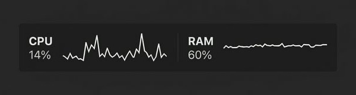

#  SysMonitor

**[View Landing Page](https://ch2ohch2oh.github.io/sysmonitor)**

  

SysMonitor is a lightweight, menu-bar system resource monitor for macOS. It provides real-time updates for:

- **CPU Usage**: Real-time percentage.
- **RAM Usage**: Real-time percentage and Used/Total GB.
- **Disk Usage**: Used/Total GB.

## Installation

1. **Unzip the App**: Double-click `SysMonitor.zip` to extract `SysMonitor.app`.
2. **Move to Applications**: Drag `SysMonitor.app` into your `Applications` folder.
3. **Launch**: Double-click the app to start it. It will appear in your menu bar.

## Troubleshooting

### "Unverified Developer" Warning

Since this app is not signed with an Apple Developer ID, macOS may prevent it from opening initially. To bypass this:

1. **Right-click** (or Control-click) on `SysMonitor.app`.
2. Select **Open** from the context menu.
3. Click **Open** in the confirmation dialog.

You only need to do this once.

## Usage

- **Click** the menu bar item (e.g., `CPU: 12% RAM: 45%`) to see detailed stats.
- **Right-click** the menu bar item to access the **About** and **Quit** options.

## Uninstall

To remove SysMonitor from your system:

1. **Quit the App**: Click the SysMonitor icon in the menu bar and select **Quit SysMonitor**.
2. **Delete the App**: Drag `SysMonitor.app` from your `Applications` folder to the Trash.
